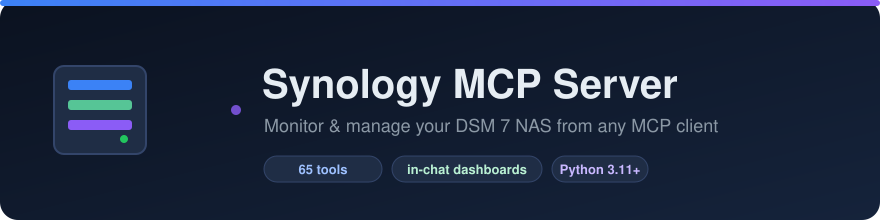
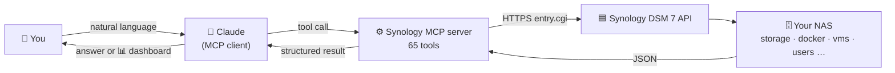
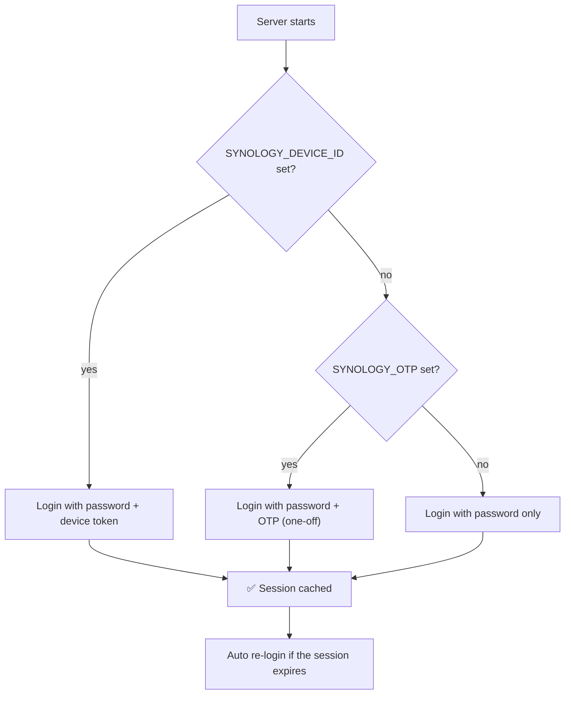

<div align="center">



# Synology MCP Server

**Monitor and manage a Synology DSM 7 NAS from any MCP client — and build live dashboards right inside the chat.**

[](https://www.python.org/)
[](https://modelcontextprotocol.io)
[](LICENSE)
[](https://www.synology.com/dsm)
[](docs/TOOLS.md)

</div>

A [Model Context Protocol](https://modelcontextprotocol.io) (MCP) server that gives an
LLM client such as **Claude** **65 tools** to monitor and manage a **Synology DSM 7**
NAS: system health, storage and disks, files, Docker, virtual machines, packages, DSM
updates, Download Station, Hyper Backup, users, services, security, certificates and
more — plus a one-call snapshot for rendering **beautiful dashboards** as artifacts.

It speaks the official DSM Web API (`entry.cgi`), handles login (including 2FA via a
persistent trusted-device token), caches the session and re-authenticates automatically.

> **Tested on DSM 7.3.2** (DS423+). Most tools use stable core APIs and work across DSM 7.x.

---

## Table of contents

- [What is an MCP server?](#what-is-an-mcp-server)
- [How it fits together](#how-it-fits-together)
- [Features](#features)
- [Quick start](#quick-start)
- [Configuration](#configuration)
  - [Environment variables](#environment-variables)
  - [Two-factor authentication](#two-factor-authentication-2fa)
- [Connecting an MCP client](#connecting-an-mcp-client)
  - [Claude Desktop](#claude-desktop)
  - [Claude Code](#claude-code)
- [Dashboards & the skill](#dashboards--the-skill)
- [Usage examples](#usage-examples)
- [Tool reference](#tool-reference)
- [Architecture](#architecture)
- [Security](#security)
- [Troubleshooting](#troubleshooting)
- [FAQ](#faq)
- [Contributing](#contributing)
- [License](#license)

---

## What is an MCP server?

The **[Model Context Protocol](https://modelcontextprotocol.io) (MCP)** is an open
standard that lets AI assistants talk to external tools and data sources in a uniform
way. An **MCP server** exposes a set of *tools* (functions the model can call) over a
simple protocol; an **MCP client** (the app you chat in, e.g. Claude Desktop) connects to
the server and lets the model call those tools on your behalf.

Think of it as a **universal adapter between the AI and your software**: instead of the
model guessing, it calls a real function that returns real data.

**This project is an MCP server for your Synology NAS.** It translates plain requests like
*“how full are my volumes?”* or *“restart the Home Assistant container”* into authenticated
calls to the Synology DSM API, and hands structured results back to the model — which then
answers you or renders a dashboard.

```
You ──▶ Claude (MCP client) ──▶ Synology MCP server ──▶ DSM Web API ──▶ your NAS
                ▲                                                          │
                └──────────────  results / dashboard  ◀───────────────────┘
```

You don't need to know any of the API details — just install the server, point it at your
NAS, connect your client, and ask in natural language.

## How it fits together



The server authenticates once (with optional 2FA via a trusted-device token), caches the
session, and re-authenticates automatically when it expires.

---

## Features

- **65 tools** across 18 domains — see the full [Tool Reference](docs/TOOLS.md).
- **Monitoring:** system info, CPU/RAM/network load, health, connections, processes.
- **Storage:** volumes, storage pools, per-disk S.M.A.R.T. and temperatures.
- **Files:** browse, search, info, directory size, MD5, create/rename/copy/move/delete,
  extract archives, public share links.
- **Apps:** Docker (containers, images, projects, logs, live stats, start/stop/restart),
  Virtual Machine Manager, Download Station, Hyper Backup, Task Scheduler.
- **Administration:** packages & DSM updates, users/groups, shared folders (create/delete),
  file services (SMB/AFP/NFS/FTP), SSH/SNMP, hardware/UPS, security, certificates, DDNS,
  QuickConnect, notifications, logs, security scan.
- **Dashboards:** `get_overview` returns a complete snapshot in one call; the bundled
  [skill](skills/synology-nas) teaches the client to render it as a polished HTML dashboard.
- **Safe by design:** state-changing tools are tagged `control`; destructive power
  operations (reboot/shutdown/DSM update) are **disabled unless explicitly enabled**.
- **No hard-coded secrets:** all credentials come from environment variables / `.env`.

---

## Quick start

```bash
# 1. Clone
git clone https://github.com/rafalr100/synology-mcp.git
cd synology-mcp

# 2. Install (uv recommended)
uv venv --python 3.12 .venv
uv pip install --python .venv -e .
#   …or:  python3 -m venv .venv && .venv/bin/pip install -e .

# 3. Configure
cp .env.example .env       # then edit URL / username / password

# 4. (only if your account uses 2FA) get a device token
.venv/bin/python bootstrap_2fa.py 123456     # 123456 = current OTP code

# 5. Verify
.venv/bin/python smoke_test.py
```

Then [connect it to a client](#connecting-an-mcp-client).

---

## Configuration

### Step 1 — Prepare the NAS

1. **Find the NAS address & port.** In DSM: *Control Panel → Network → Network Interface*
   (or your router). The default Web API port is **5000** (HTTP) / **5001** (HTTPS). Your
   URL will look like `http://192.168.1.100:5000`.
2. **(Recommended) Create a dedicated user.** *Control Panel → User & Group → Create*. Give
   it only the access it needs (the apps and shared folders you want to manage). Admin-group
   membership is required for some tools (storage, users, services, certificates, power).
3. **2FA?** If the account uses two-factor auth, keep your authenticator app handy for
   [Step 4](#two-factor-authentication-2fa). The DSM Web API itself is enabled by default —
   nothing else to turn on.

### Step 2 — Create your `.env`

Copy `.env.example` to `.env` and fill it in:

```ini
SYNOLOGY_URL=http://192.168.1.100:5000
SYNOLOGY_USER=your_username
SYNOLOGY_PASS=your_password
```

### Environment variables

| Variable | Required | Default | Description |
|----------|:--------:|---------|-------------|
| `SYNOLOGY_URL` | ✅ | `http://localhost:5000` | Base URL of the NAS (use `https://…:5001` for TLS) |
| `SYNOLOGY_USER` | ✅ | — | DSM username |
| `SYNOLOGY_PASS` | ✅ | — | DSM password |
| `SYNOLOGY_DEVICE_ID` | 2FA only | — | Trusted-device token (from `bootstrap_2fa.py`) |
| `SYNOLOGY_OTP` | — | — | One-time OTP (bootstrap only; prefer the device token) |
| `SYNOLOGY_VERIFY_SSL` | — | `false` | Verify the TLS certificate |
| `SYNOLOGY_TIMEOUT` | — | `30` | HTTP timeout (seconds) |
| `SYNOLOGY_SESSION_NAME` | — | `SynologyMCP` | Session name shown in DSM |
| `SYNOLOGY_DEVICE_NAME` | — | `SynologyMCP` | Device name shown in DSM |
| `SYNOLOGY_ENABLE_POWER_CONTROL` | — | `false` | Allow `reboot_nas` / `shutdown_nas` / `install_dsm_update` |

See [docs/CONFIGURATION.md](docs/CONFIGURATION.md) for details.

### Step 3 — How login works



### Two-factor authentication (2FA)

If your account has 2FA enabled, a password alone cannot log in. Exchange **one** OTP
code for a **persistent trusted-device token** (so you never need an OTP again):

```bash
.venv/bin/python bootstrap_2fa.py 123456     # current 6-digit code from your authenticator
```

This appends `SYNOLOGY_DEVICE_ID=…` to your `.env`. If the token is ever invalidated
(e.g. after a password change), simply run the bootstrap again.

---

## Connecting an MCP client

> The server runs locally and talks to your NAS over the LAN. It works with local
> clients (Claude Desktop, Claude Code). It is **not** reachable from the claude.ai
> web app, whose cloud servers cannot see your local network.

### Claude Desktop

Edit the config file:

- **macOS:** `~/Library/Application Support/Claude/claude_desktop_config.json`
- **Windows:** `%APPDATA%\Claude\claude_desktop_config.json`

```json
{
  "mcpServers": {
    "synology": {
      "command": "/absolute/path/to/synology-mcp/.venv/bin/python",
      "args": ["-m", "synology_mcp"],
      "env": {
        "PYTHONPATH": "/absolute/path/to/synology-mcp",
        "SYNOLOGY_URL": "http://192.168.1.100:5000",
        "SYNOLOGY_USER": "your_username",
        "SYNOLOGY_PASS": "your_password",
        "SYNOLOGY_DEVICE_ID": "your_device_token_if_2fa"
      }
    }
  }
}
```

Fully quit and reopen Claude Desktop — the Synology tools then appear in the tools menu.
A ready-to-edit copy lives in [`examples/claude_desktop_config.example.json`](examples/claude_desktop_config.example.json).

### Claude Code

```bash
claude mcp add synology -- /absolute/path/to/synology-mcp/.venv/bin/python -m synology_mcp
```

…or drop a project-scoped [`.mcp.json`](.mcp.json.example) in your working directory.

> **Tip:** keep credentials only in `.env` — the server auto-loads it from its own
> directory, so you can omit the `env` block in the client config.

---

## Dashboards & the skill

Ask the client for *“a dashboard of my NAS”* and it will call **`get_overview`** (one
round-trip returning system, load, storage, disks and workload counts) and render a
**self-contained HTML dashboard** as an artifact.

The repo ships a [Claude skill](skills/synology-nas) (`skills/synology-nas/SKILL.md`)
that teaches the client when to use which tool and how to render dashboards — including a
[design guide](skills/synology-nas/references/dashboard_design.md) and an
[HTML template](skills/synology-nas/assets/dashboard_template.html). See
[docs/DASHBOARDS.md](docs/DASHBOARDS.md).

---

## Usage examples

Natural-language prompts you can use once connected:

- *“Give me an overview / dashboard of my NAS.”*
- *“How full are my volumes, and are all disks healthy?”*
- *“Is a DSM update available? Which Docker images can be updated?”*
- *“Show running containers and restart `homeassistant`.”* (asks to confirm)
- *“List virtual machines and their state.”*
- *“What’s connected right now, and show the last 10 system log entries.”*
- *“Search `/home` for `*.pdf` and tell me the size of `/docker`.”*
- *“Are SSH and SMB enabled? What’s my DDNS hostname and certificate expiry?”*

More in [examples/prompts.md](examples/prompts.md).

---

## Tool reference

All **65 tools** are documented — with parameters and what each returns — in
**[docs/TOOLS.md](docs/TOOLS.md)**. Summary by domain:

| Domain | Tools |
|--------|-------|
| Dashboard | `get_overview` |
| System monitoring | `get_system_info`, `get_resource_usage`, `get_network_info` |
| Health & activity | `get_system_health`, `get_active_connections`, `list_processes` |
| Storage | `get_storage_info`, `get_storage_pools`, `get_disk_info` |
| Files | `list_shares`, `list_files`, `get_file_info`, `get_directory_size`, `get_file_md5`, `search_files`, `create_folder`, `rename_item`, `copy_move_item`, `delete_item`, `extract_archive`, `create_share_link` |
| Packages & updates | `check_dsm_update`, `list_packages`, `set_package_state` |
| Docker | `list_containers`, `get_container_logs`, `get_container_stats`, `list_docker_projects`, `list_docker_images`, `set_container_state` |
| Virtual machines | `list_virtual_machines`, `set_vm_state` |
| Download Station | `list_downloads`, `add_download`, `manage_download` |
| Backup | `list_backup_tasks`, `run_backup_task` |
| Task Scheduler | `list_scheduled_tasks`, `run_scheduled_task` |
| Users & shares | `list_users`, `list_groups`, `list_shared_folders`, `create_shared_folder`, `delete_shared_folder` |
| Services | `get_file_services`, `set_file_service`, `get_terminal_settings`, `get_snmp_settings` |
| Hardware | `get_power_settings`, `get_hibernation_settings`, `get_ups_status`, `list_usb_devices` |
| Security | `get_security_settings`, `get_autoblock_settings`, `get_firewall_status`, `list_certificates` |
| Network services | `get_ddns_status`, `get_quickconnect_status` |
| Notifications | `get_notification_settings` |
| Logs & scan | `get_system_logs`, `get_security_scan_status` |
| Power (opt-in) | `reboot_nas`, `shutdown_nas`, `install_dsm_update` |

---

## Architecture

```
synology_mcp/
├── config.py          # settings from env / .env (no hard-coded secrets)
├── api.py             # async DSM client: login, 2FA, session, auto-reauth
├── app.py             # shared FastMCP instance + formatting helpers
├── server.py          # entry point (python -m synology_mcp)
└── tools/             # one module per domain; importing registers the tools
    ├── dashboard.py      monitoring.py   system.py     storage.py
    ├── files.py          packages.py     docker.py     virtualization.py
    ├── downloads.py      backup.py       scheduler.py  admin.py
    ├── services.py       hardware.py     security.py   network_services.py
    ├── notifications.py  power.py
skills/synology-nas/   # Claude skill: tool guidance + dashboard rendering
docs/                  # TOOLS.md, CONFIGURATION.md, DASHBOARDS.md
examples/              # client config + example prompts
```

Every call goes through the DSM `entry.cgi` gateway; API versions were verified against a
live DSM 7.3.2 system. Adding a tool: write an `@mcp.tool()` async function in a module
under `synology_mcp/tools/` and add the module to `tools/__init__.py`.

---

## Security

- **Credentials live in `.env` / client config, never in code.** `.env` and `.mcp.json`
  are git-ignored.
- Prefer a **dedicated DSM account** with only the privileges you need over the main admin.
- Intended for **trusted local-network** use.
- **Power operations are opt-in** via `SYNOLOGY_ENABLE_POWER_CONTROL=true`.
- The HTTP client silences request logging so credentials never reach stderr.

---

## Troubleshooting

| Symptom | Cause / fix |
|---------|-------------|
| `auth failed (code 400)` | Wrong username or password. |
| `auth failed (code 403/406)` | Account uses 2FA — run `python bootstrap_2fa.py <OTP>` to get a device token. |
| `auth failed (code 400)` after enabling 2FA | The OTP expired (30 s window) — re-run the bootstrap with a fresh code. |
| `Synology API error (code 105)` | Your account lacks permission for that action (use an admin account). |
| `Synology API error (code 119)` | Session expired — handled automatically; if it persists, restart the server. |
| Tools don’t appear in Claude Desktop | Fully **quit** (not just close) and reopen; check the config path and that the `command` path is absolute. |
| `ModuleNotFoundError: synology_mcp` | Set `PYTHONPATH` to the repo root in the client `env`, or `pip install -e .`. |
| Connection timeout | Check `SYNOLOGY_URL`/port and that the NAS is reachable; raise `SYNOLOGY_TIMEOUT`. |
| TLS certificate error | Use `http://…:5000`, or set `SYNOLOGY_VERIFY_SSL=false` (default) for self-signed certs. |
| A feature tool errors | That package/feature may not be installed/enabled (e.g. VMM, Docker, UPS, DDNS). |

---

## FAQ

**Does this work with the claude.ai website or mobile app?**
No — those run in Anthropic’s cloud, which can’t reach a NAS on your LAN. Use a local
client (Claude Desktop / Claude Code). For remote access you’d need a VPN (e.g. Tailscale)
and a remote MCP transport, which is out of scope here.

**Which DSM versions are supported?**
Built and tested on **DSM 7.x** (7.3.2). DSM 6 uses older API paths and is not supported.

**Is it safe? Can it delete my data?**
Read tools are safe. State-changing tools are tagged `control`; a well-behaved client
confirms before using them. Reboot/shutdown/update require an explicit opt-in flag.

**Does it store my password?**
Only where you put it — in `.env` or the client config, both local to your machine.

**Can I run it without 2FA?**
Yes. 2FA is optional; without it, username + password is enough.

---

## Contributing

Issues and pull requests are welcome — see [CONTRIBUTING.md](CONTRIBUTING.md).

---

## License

[MIT](LICENSE).

> Not affiliated with or endorsed by Synology Inc. “Synology” and “DSM” are trademarks of
> their respective owners.
